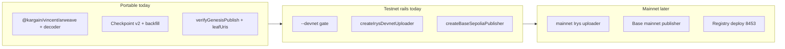

# Mainnet readiness checklist

Living maintainer doc for `@kargain/vincent-publish` and Kargain integration. Answers: what is production-portable today, what runs on testnet only, and what remains before dual-network (testnet validation + mainnet genesis) support.

## Summary

**Architecture** — gateway-first verification, checkpoint v2, Merkle truth with GraphQL as discovery — is **mainnet-portable**. It is not a devnet workaround; devnet exposed indexing lag and the tooling was hardened accordingly.

**Rails** — CLI `--devnet` gate, `createIrysDevnetUploader`, and `createBaseSepoliaPublisher` — are **testnet-only today**.

**Kargain** should validate on **Base Sepolia + Irys devnet** now. Foundational mainnet genesis is a separate founder step (deploy, economics, key retirement). See [PROTOCOL §8.1](../../docs/PROTOCOL.md) for foundational vs overlay publisher roles.



## Dual-network matrix

| Area | Testnet (now) | Mainnet (target) | Status |
|------|---------------|------------------|--------|
| Registry | Base Sepolia 84532, CREATE2 [`0x06667DB3795C70F34b7517D1Af1217D3167BE241`](../../docs/contracts/README.md) | Base 8453, same CREATE2 address | Sepolia deploy pending verify column |
| Chain adapter | [`createRegistryPublisher`](../src/adapters/registry-publisher.ts) + Base Sepolia wrappers | `createRegistryPublisher({ chain: base, rpcUrl })` on 8453 | C2 + C3 env scaffold done |
| Irys upload | [`createIrysDevnetUploader`](../src/adapters/irys-devnet-uploader.ts) + `devnet.irys.xyz` | Mainnet bundler + funding path | Not implemented |
| Gateway | `--devnet` → `testnet-gateway.irys.xyz` | `gateway.irys.xyz` | Constants exist; CLI gated |
| GraphQL | `uploader.irys.xyz/graphql` | Same | Shared |
| SDK `getLeaf` | `createArweaveGetLeafWithUris`, `resolveLeafTxId`, `backfillLeafUrisFromGraphql`, `fetchLeafFromGateway` in `@kargain/vincent` 0.10.0 | Same | Done |
| Publish API | Root exports: checkpoint, `verifyGenesisPublish`, `verifyUploadedLeaves`, backfill, Base Sepolia (B1) | + mainnet adapters when C lands | Testnet adapters exported |
| v1 migration | B2 `needsLeafUriBackfillHint` → run `backfill:leaf-uris` | Same | Done |
| Timing | 180s pre-index delay, 60s post-reupload (full) | Likely 0–30s on mainnet | Devnet-tuned |

## Completed (architecture + integration)

- [x] **A1–A3** — SDK GraphQL consolidation, gateway fetch, `createArweaveGetLeafWithUris`
- [x] Publish thin re-exports from `@kargain/vincent/arweave` (no GraphQL duplication)
- [x] **B1** — programmatic export surface from [`publish/src/index.ts`](../src/index.ts)
- [x] **B2** — stderr hint when index-verified leaves exist but `leafUris` is empty
- [x] Gateway-first index-check (checkpoint `leafUris` → one-shot GraphQL → re-upload → gateway)
- [x] Bulk `backfill-leaf-uris` CLI + `backfillLeafUrisFromGraphql`
- [x] `waitForLatestEpoch` race guard (`minEpochCount` + `expectedManifestUri`)
- [x] Live devnet validation: epoch 2 backfill + `PASS --verify-only` (founder-run)
- [x] 131+ publish tests + SDK arweave tests green

## Backlog

### P0 — Kargain testnet integration stable

- [x] Gateway-first verification path (publish + SDK)
- [x] Bulk `backfill-leaf-uris` + checkpoint `leafUris`
- [x] `waitForLatestEpoch` race guard
- [x] Export surface for automation (B1)
- [x] Document env contract — see [`.env.example`](../.env.example) and env table in [publish README](../README.md)

### P1 — dual-network scaffolding (code, not deploy)

- [x] **C1** — `BASE_MAINNET_CHAIN_ID`, `IRYS_MAINNET_BUNDLER_URL`, `resolveIrysBundlerUrl` in [`constants.ts`](../src/constants.ts) (Kargain `irysNodeUrl` aligned)
- [x] **C2** — `createRegistryPublisher` / `createRegistryReader` with `createBaseSepoliaPublisher` backward-compatible alias
- [x] **C3** — commented mainnet section in [`.env.example`](../.env.example)
- [ ] Remove `--devnet` hard gate or add `--mainnet` path in [`publish-epoch` CLI](../src/cli/publish-epoch.ts)
- [ ] `createIrysMainnetUploader` (real mainnet economics)
- [ ] Re-upload cost guard (`--allow-reupload` / cap) for large epochs (~14k leaves)
- [ ] Mainnet timing defaults (review `DEFAULT_FULL_INDEX_CHECK_DELAY_MS`, `DEFAULT_POST_REUPLOAD_DELAY_MS`)

### P2 — founder / ops (outside repo automation)

- [ ] Deploy + verify VincentAnchorRegistry on Base mainnet (8453); update [docs/contracts/README.md](../../docs/contracts/README.md) Verified column
- [ ] Lift “Do not deploy to mainnet” guard in [contracts/README.md](../../contracts/README.md) when ready
- [ ] Live mainnet Irys smoke test (upload + gateway + GraphQL + anchor)
- [ ] Foundational genesis key retirement playbook ([PROTOCOL §8.1](../../docs/PROTOCOL.md))
- [ ] Optional: `leafUris` sidecar / bulk index for third-party verifiers without local checkpoint

## Risks

| Risk | Severity | Mitigation | Status |
|------|----------|------------|--------|
| GraphQL query drift (publish vs SDK) | High | Consolidated in `@kargain/vincent/arweave` (A1) | Mitigated |
| Publisher address case mismatch in GraphQL | Medium | `normalizePublisherAddress` (lowercase) in SDK | Mitigated |
| Re-upload ×2 on ~14k leaves on mainnet | High | Cost guard / `--allow-reupload` (P1) | Open |
| `leafUris` only in local checkpoint | Medium | Ops: backfill CLI; optional protocol sidecar (P2) | Accepted ops constraint |
| v1 checkpoint without `leafUris` | Low | Auto stderr hint + `backfill:leaf-uris` (B2) | Mitigated |
| `waitForLatestEpoch` default 6s polling | Low | Configurable `maxAttempts` / `delayMs` | Tunable |
| Devnet-only CLI and upload rails | High | Phase C + mainnet Irys uploader (P1) | Open |

## Kargain integration (testnet)

1. **Imports** — orchestration from `@kargain/vincent-publish`; decoder clients from `@kargain/vincent/arweave` (`createArweaveGetLeafWithUris`, `resolveLeafTxId`). See [Programmatic automation](../README.md#programmatic-automation-kargain) in the publish README.
2. **Env** — `BASE_SEPOLIA_RPC_URL`, `VINCENT_GENESIS_PRIVATE_KEY`, optional `IRYS_GATEWAY_URL` / `IRYS_GRAPHQL_URL` ([`.env.example`](../.env.example)).
3. **Checkpoint** — if stderr shows the B2 backfill hint, run `backfill:leaf-uris` before `--anchor-only` or heavy index-check.
4. **Verify** — use `--verify-only` (or `verifyGenesisPublish` + checkpoint `leafUris`) before trusting an anchor.

Registry and Irys tag contract match Kargain web: `App=vincent`, `Epoch`, `LeafKey`; registry CREATE2 address matches `DEFAULT_REGISTRY_ADDRESS` in `@kargain/vincent/anchor`.

## Verification

Offline (CI):

```bash
pnpm --filter @kargain/vincent-publish test
pnpm --filter @kargain/vincent test
```

Live testnet (founder, requires keys and `.env`):

```bash
pnpm --filter @kargain/vincent-publish backfill:leaf-uris -- --devnet --epoch N
pnpm --filter @kargain/vincent-publish publish:epoch -- --devnet --full --verify-only \
  --publisher <addr> --manifest-uri ar://...
```

See [publish README](../README.md) for full CLI playbook.

## Related docs

- [publish/README.md](../README.md) — CLI, checkpoint, backfill playbook
- [docs/PROTOCOL.md](../../docs/PROTOCOL.md) — publisher roles, anchoring
- [docs/contracts/README.md](../../docs/contracts/README.md) — deployed registry addresses
